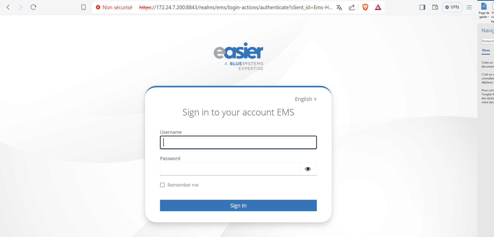
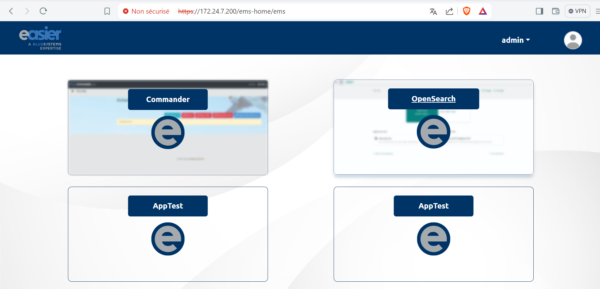
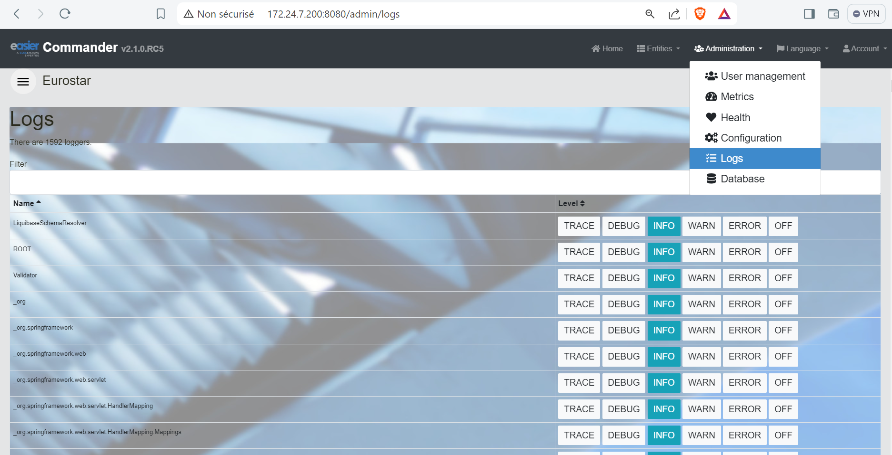
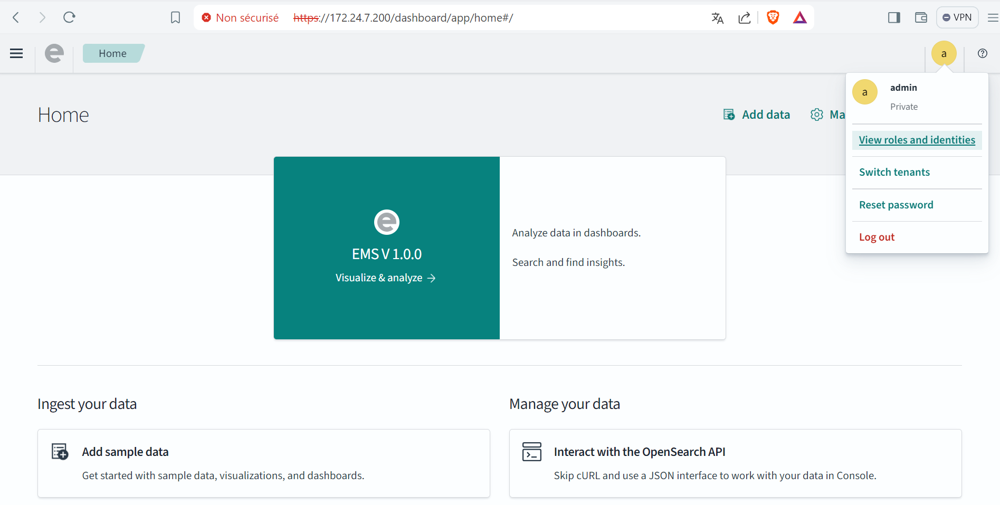
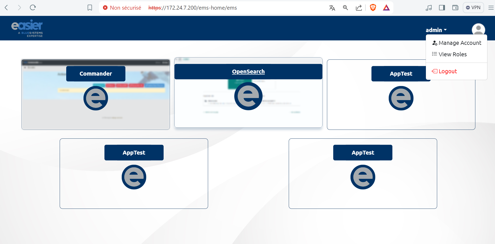
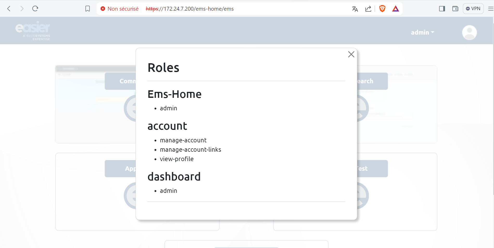
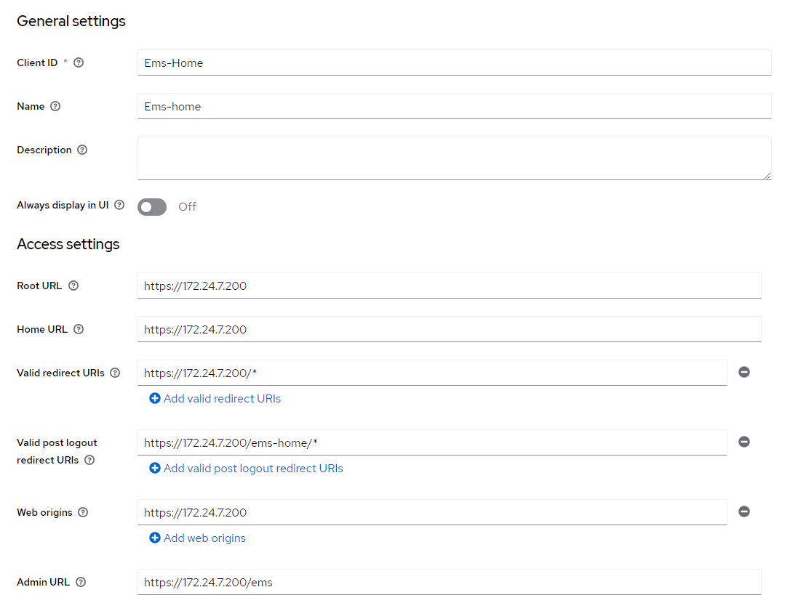
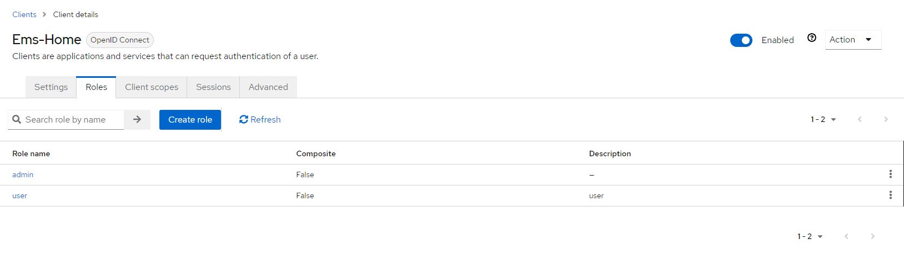
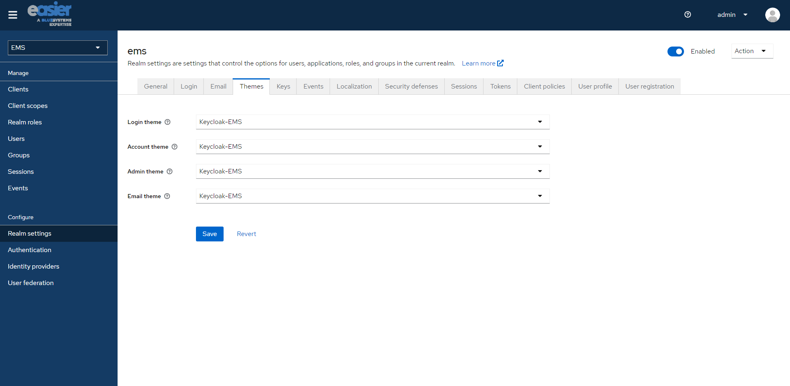
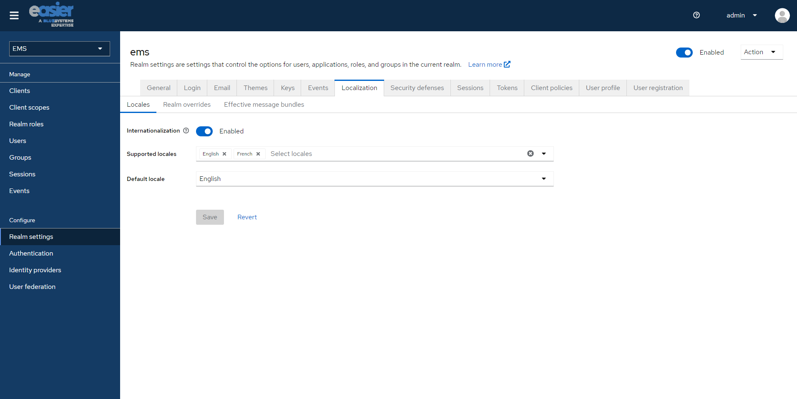

# Quelle est la finalité de l'application EMS-Home ?

L'application **EMS-Home** a pour finalité de servir de point d'accès centralisé à plusieurs applications au sein d'un environnement d'entreprise. Elle permet aux utilisateurs de naviguer facilement entre différentes applications sans avoir à se réauthentifier à chaque fois, grâce à l'intégration d'un système d'authentification unique (Single Sign-On) via Keycloak.

# Quels problèmes cette application résout-elle ?

**EMS-Home** résout plusieurs problèmes majeurs :
1. **Multiples Authentifications** : En intégrant un système d'authentification unique, les utilisateurs n'ont pas besoin de se reconnecter à chaque application individuellement, ce qui simplifie et accélère l'accès aux ressources.
2. **Gestion Centralisée des Utilisateurs** : L'application centralise la gestion des utilisateurs et des rôles, facilitant ainsi l'administration et la maintenance des droits d'accès.
3. **Déconnexion Automatique** : Lorsqu'un utilisateur se déconnecte d'une application, il est automatiquement déconnecté de toutes les autres applications, assurant ainsi une sécurité accrue.
   
# Comment récupérer le code source de l'application EMS-HOME ?

Pour cloner le dépôt contenant le code source de l'application EMS-HOME, vous pouvez utiliser la commande suivante :

```cmd
git clone git@gitlab.ier.group:ems/internship/commanderui.git
```

# Comment ça marche ?

## 1. Accès à l'application EMS-Home

L'application EMS-Home est accessible via l'URL suivante : [https://172.24.7.200/ems-home](https://172.24.7.200/ems-home).

<div style="page-break-after: always;"></div>

## 2. Connexion

Une fois sur la page d'accueil, vous êtes invité à vous connecter avec un compte EMS via le service d'authentification Keycloak.



## 3. Page d'accueil

Après une connexion réussie, vous êtes redirigé vers la page d'accueil de l'application EMS-Home. Sur cette page, vous pouvez accéder aux différentes applications disponibles telles que **Commander** et **OpenSearch**, selon la configuration.


<div style="page-break-after: always;"></div>

## 4. Accès à l'application Commander

En cliquant sur **Commander**, vous êtes redirigé vers cette application sans avoir besoin de vous reconnecter.



## 5. Accès à l'application OpenSearch

De la même manière, en cliquant sur **OpenSearch**, vous êtes redirigé vers cette application sans avoir besoin de vous reconnecter.


<div style="page-break-after: always;"></div>

## 6. Menu de navigation

Sur la barre de navigation, un menu déroulant est disponible avec les options suivantes :
- **Manage Account** : Gestion du compte
- **View Roles** : Visualisation des rôles
- **Logout** : Déconnexion



## 7. Visualisation des rôles

Vous pouvez voir les rôles de l'utilisateur actuel pour les différentes applications disponibles.


<div style="page-break-after: always;"></div>

## 8. Déconnexion

Pour vous déconnecter de toutes les applications, il suffit de vous déconnecter de EMS-Home. Cela déconnectera automatiquement toutes les autres applications.

# Comment l'application est-elle configurée ?

L'application **ems-home** est développée avec Angular CLI et comprend plusieurs composants et services essentiels à son bon fonctionnement. L'un des services les plus cruciaux est **Keycloak**, qui assure la sécurité de l'application et permet la gestion du single sign-on (SSO).

## Initialisation de Keycloak

Le service Keycloak est initialisé dans le **KeycloakService** via la fonction `init()`. Cette fonction récupère la configuration Keycloak à partir d'un service de configuration, puis initialise le client Keycloak avec les paramètres appropriés (URL, realm, clientId). Voici comment cette fonction est implémentée :

```typescript
init() {
  this.configService.getConfig().subscribe((data: any) => {
    this.config = data.keycloak;
    console.log("config:", this.config.clientId);

    this._keycloak = new Keycloak({
      url: this.config.url,
      realm: this.config.realm,
      clientId: this.config.clientId,
    });

    console.log('Keycloak initialization started', this.config);
    this.loaderService.show();

    this._keycloak.init({
      onLoad: 'login-required',
    }).then(async authenticated => {
      if (authenticated) {
        console.log('User authenticated successfully');
        await this.loadProfile();
        this._details = this._keycloak?.resourceAccess;
        console.log('details:', this._details);
      } else {
        console.warn('User is not authenticated');
      }
      this._keycloakInitialized.next(true);
    }).catch(initError => {
      this._keycloakInitialized.next(true);
      console.error('Keycloak initialization failed:', initError);
      this.router.navigate(['/errorkeycloakinit']);
    }).finally(() => {
      console.log("Finalizing Keycloak initialization");
      this.loaderService.hide();
      this._keycloakInitialized.next(true);
    });
  });
}
```

## Application de la Configuration

Cette fonction d'initialisation est appelée dans le fichier **app.config.ts** afin de s'appliquer à toute l'application, garantissant que chaque accès nécessite une authentification via le service Keycloak.

```typescript
import { APP_INITIALIZER, ApplicationConfig, importProvidersFrom } from '@angular/core';
import { provideRouter } from '@angular/router';
import { routes } from './app.routes';
import { HttpClientJsonpModule, HttpClientModule } from "@angular/common/http";
import { KeycloakService } from "./services/keycloak/keycloak.service";
import { ConfigService } from "./services/config/config.service";

export function kcFactory(kcService: KeycloakService) {
  return () => kcService.init();
}

export const appConfig: ApplicationConfig = {
  providers: [
    ConfigService,
    KeycloakService,
    {
      provide: APP_INITIALIZER,
      useFactory: kcFactory,
      deps: [KeycloakService],
      multi: true
    },
    provideRouter(routes),
    importProvidersFrom(HttpClientModule),
    importProvidersFrom(HttpClientJsonpModule),
  ]
};
```
<div style="page-break-after: always;"></div>

## Configuration Keycloak

Lors de l'appel au service Keycloak, le client est automatiquement redirigé vers l'URL de Keycloak spécifiée avec le realm et le clientId déjà créés sur Keycloak. Voici les étapes de configuration dans Keycloak :

1. **Création d'un client avec des configurations spécifiques pour l'application ems-home :**
   
   

2. **Ajout de deux rôles pour le client ems-home :**
   
   
   <div style="page-break-after: always;"></div>

3. **Application d'un thème personnalisé :**
   
   

4. **Configuration de l'interface de connexion multilingue :**
   
   
<div style="page-break-after: always;"></div>

## Fichier de Configuration (config.json)

L'application repose sur un fichier de configuration nommé `config.json`, qui contient toutes les configurations de démarrage, URL et autres paramètres essentiels.

```json
{
  "keycloak": {
    "url": "https://172.24.7.200:8843", // URL du serveur Keycloak
    "realm": "ems",                      // Nom du realm Keycloak
    "clientId": "Ems-Home"               // ID du client Keycloak
  },
  "home": {
    "url": "https://172.24.7.200/ems-home/ems" // URL de la page d'accueil de l'application
  },
  "logout": {
    "url": "https://172.24.7.200/ems-home/ems" // URL de déconnexion
  },
  "applications": [
    {
      "name": "commander",
      "url": "https://172.24.7.200",
      "label": "Commander",
      "imageUrl": "./assets/images/commander.png" // URL de l'image du bouton Commander
    },
    {
      "name": "opensearch",
      "url": "https://172.24.7.200/dashboard",
      "label": "OpenSearch",
      "imageUrl": "./assets/images/opensearch.png" // URL de l'image du bouton OpenSearch
    },
    {
      "name": "APPtest",
      "url": "https://172.24.7.200/apptest",
      "label": "AppTest",
      "imageUrl": "./assets/images/no-images.jpg" // URL de l'image du bouton AppTest
    }
  ]
}
```
<div style="page-break-after: always;"></div>

# Comment générer et déployer l'application EMS-home?

Pour déployer l'application EMS-home sur le serveur, il faut d'abord générer l'image Docker de l'application.

## Étapes pour générer l'image Docker
#### 1. **Créer un fichier Dockerfile** : Ce fichier contient les instructions nécessaires pour construire l'image Docker de l'application.

```dockerfile
## Utiliser l'image node:18 comme étape de construction
FROM node:18 as build-stage

# Définir le répertoire de travail
WORKDIR /app

# Copier les fichiers package.json et package-lock.json
COPY package*.json ./

# Installer les dépendances
RUN npm install

# Copier tous les fichiers de l'application
COPY . .

# Construire l'application pour la production
RUN npm run build --prod

# Utiliser l'image nginx:alpine comme étape finale
FROM nginx:alpine

# Copier la configuration nginx personnalisée
COPY nginx.conf /etc/nginx/nginx.conf

# Copier les fichiers construits depuis l'étape de construction
COPY --from=build-stage /app/dist/test3 /usr/share/nginx/html

# Exposer le port 8080
EXPOSE 8080

```
#### 2. Construire l'image Docker : Exécutez la commande suivante pour créer l'image Docker.

```bash
docker build -t easierrep/ems-home:latest .
```

#### 3. Pousser l'image sur Docker Hub : Utilisez cette commande pour envoyer l'image Docker au dépôt Docker Hub.

```bash
docker push easierrep/ems-home:latest
```

## Déploiement sur le serveur

#### 1. Récupérer l'image Docker sur le serveur : Connectez-vous au serveur via SSH et téléchargez l'image Docker.

```bash
docker pull easierrep/ems-home:latest
```

#### 2. Mettre à jour le fichier docker-compose : Ajoutez le service ems-home dans le fichier /ems/ems_keycloak/docker-compose.yml.

```yml
ems-home:
  container_name: ems-home
  restart: always
  image: easierrep/ems-home:1.1.2
  ports:
    - "5500:8080"
  networks:
    - opensearch-net
  volumes:
    - ./ems-home-volumes/config:/usr/share/nginx/html/browser/assets/config
    - ./ems-home-volumes/images:/usr/share/nginx/html/browser/assets/images
```

#### 3. Configurer Nginx pour HTTPS : Ajoutez la configuration suivante dans le fichier Nginx /ems/ems_keycloak/nginx/ssl/nginx.config pour rendre l'application accessible via HTTPS.

```nginx
location /ems-home/ {
    proxy_pass http://ems-home:8080/;
    proxy_set_header Host $http_host;
    sub_filter_types text/html;
    sub_filter 'href="/' 'href="/ems-home/';
    sub_filter 'src="/' 'src="/ems-home/';
    sub_filter_once off;
}
```
<div style="page-break-after: always;"></div>

#### 4. Lancer le docker compose : Exécutez les commandes suivantes pour démarrer les services définis dans le fichier docker-compose.yml.

```bash
cd /ems/ems_keycloak
docker compose up
```

### **Accéder à l'application:**

Une fois que tous les services sont démarrés, l'application EMS-home sera accessible via HTTPS à l'adresse suivante : [https://172.24.7.200/ems-home](https://172.24.7.200/ems-home).


